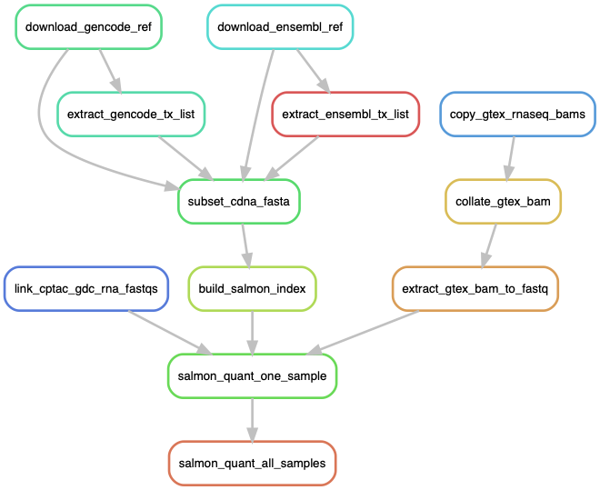

# 201901_gene_quantification
RNA-seq gene expression quantification using Salmon.

Two transcript annotations were used:

- GENCODE v29 basic transcripts (Ensembl v94)
- All Ensembl v94 transcripts

For GTEx normal samples, their original RNA-seq BAMs are copied from MGI first
to extract the reads into paired FASTQ files.

## Installation

    conda create -n gbm_rna \
        "python>=3.7" \
        snakemake-minimal \
        samtools \
        salmon ipython

Version of important tools:
- Salmon: 0.12.0
- samtools: 1.9

## Pipeline execution
Copy the GTEx RNA-seq BAMs and extract their reads to FASTQs by:

    snakemake get_all_gtex_rna_fastqs

Link the CPTAC RNA-seq FASTQs from GDC by:
    
    snakemake link_cptac_gdc_rna_fastqs

Generate the Salmon indices of all annotation sources by:

    snakemake build_all_salmon_indices

Run the gene quantification of all samples using all annotation sources by:

    snakemake salmon_quant_all_samples

### Pipeline workflow

